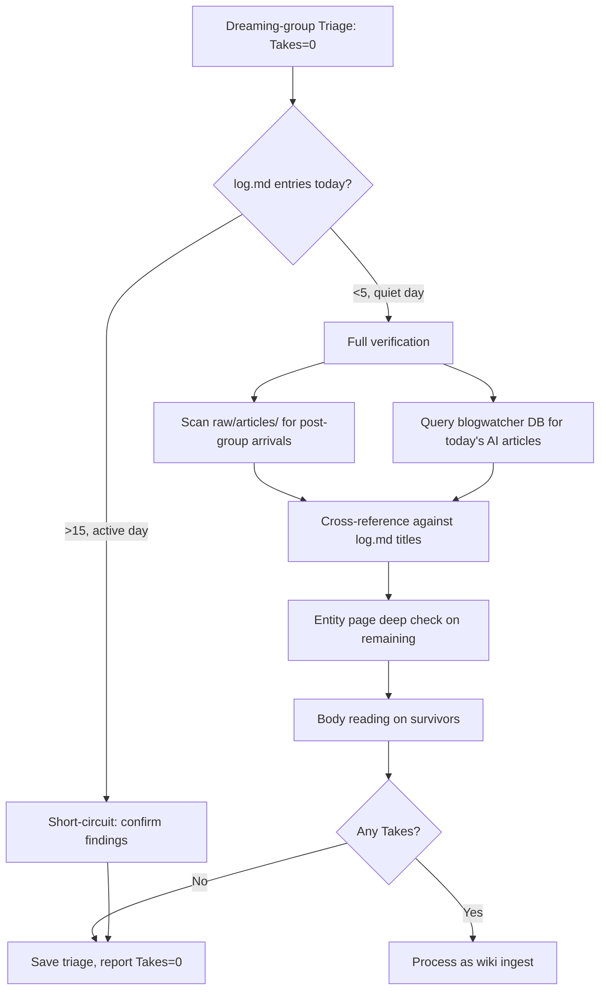

# Dreaming-Wiki-Ingest Verification Pattern

**Why verify?** The dreaming-group runs at 18:10 UTC and scans raw/articles/ for the last 1-3 days. By the time `dreaming-wiki-ingest` runs at 18:20, the data landscape has often shifted — blog-ingest articles may have arrived at 07:00 (half a day earlier and already consumed by blog-wiki-ingest), and raw articles may have landed from multiple other pipelines. The dreaming-group's "99%+ processed" claim needs independent confirmation.

## The Verification Gap

The dreaming-group scans **raw/articles/ file metadata** (size, date) and uses `search_files` on log.md. What it may NOT do:
- Query blogwatcher DB for today's articles (blogwatcher has content blog-ingest hasn't yet converted to raw/articles/ format)
- Read entity page content to verify article summary ≠ mere URL mention (the "mentioned ≠ covered" pitfall)
- Check for articles that arrived AFTER the dreaming-group's scan window

## Verification Procedure

### Step 1: Check same-day log.md the hard way

The dreaming-group already checked log.md. But do a quick grep yourself:

```python
with open("~/wiki/log.md") as f:
    content = f.read()
today_count = len(re.findall(r'## \[2026-05-28\]', content))
print(f"Today's log entries: {today_count}")
```

Expected: 15-30 entries on active days. 3-8 on quiet days.
Signal to watch for: if fewer than 3 entries, the other pipelines may not have run — investigate separately.

### Step 2: Scan raw/articles/ for post-group arrivals

```python
import os, datetime
raw_dir = os.path.expanduser("~/wiki/raw/articles")
now = datetime.datetime.now()
for fname in sorted(os.listdir(raw_dir)):
    if not fname.endswith('.md'):
        continue
    path = os.path.join(raw_dir, fname)
    mtime = os.path.getmtime(path)
    dt = datetime.datetime.fromtimestamp(mtime)
    age_hours = (now - dt).total_seconds() / 3600
    size = os.path.getsize(path)
    if age_hours < 3 and size > 500:
        print(f"RECENT ({dt:%H:%M}) | {size}B | {fname}")
```

Expected yield: 0-5 articles arriving between 15:00-18:20 UTC (active-crawl outputs, late X account posts).

### Step 3: Query blogwatcher DB for today's AI-relevant articles

This is the **most valuable independent check**. The blog-ingest pipeline ran at 07:00 UTC and may have captured articles the dreaming-group missed because they weren't AI-keyword-matched in their filename-based scan.

```python
import sqlite3
conn = sqlite3.connect("/opt/data/.blogwatcher/blogwatcher.db")
ai_keywords = ['llm', 'agent', 'ai ', 'model', 'gpt', 'claude', 'codex', 'openai',
               'anthropic', 'inference', 'training', 'benchmark', 'coding', 'harness',
               'orchestrat', 'mcp', 'tool', 'safety', 'alignment', 'rag', 'evaluation']

rows = conn.execute("""
    SELECT b.name, a.title, a.url, a.published_date
    FROM articles a JOIN blogs b ON a.blog_id = b.id
    WHERE DATE(a.discovered_date) = ?
    ORDER BY a.discovered_date DESC
""", (date_str,)).fetchall()

ai_articles = [r for r in rows if any(kw in (r['title'] or '').lower() for kw in ai_keywords)]
print(f"Blogwatcher today: {len(rows)} total, {len(ai_articles)} AI-relevant")
```

Expected yield:
- 30-60 total articles on an active day
- 10-25 AI-relevant (35-40% of total)
- Of those, ~90% already consumed by blog-wiki-ingest at 07:50 UTC
- Expect 1-3 genuinely unprocessed candidates

### Step 4: Cross-reference candidates against log.md TITLES

Not just keywords — search for the article's **actual title words** in log.md. The blog-wiki-ingest log entry names articles explicitly:

```
## [2026-05-28] blog-wiki-ingest | Simon Willison PMF, Codex Tax AI, Warp GPT-5.5, ...
```

Use this pattern:
```python
with open(log_path) as f:
    log_content = f.read()

for article in candidates:
    title_words = set(article['title'].lower().split()[:5])
    matched = any(w in log_content.lower() for w in title_words if len(w) > 4)
```

If the log entry explicitly names the article, it was consumed — skip with "already captured by blog-wiki-ingest".

### Step 5: Entity page deep check (the "mentioned ≠ covered" trap)

For any remaining candidates, check entity pages for SUBSTANTIVE content, not just URL references:

```python
def entity_has_content(entity_name, keywords):
    """Check if entity page has real content, not just a URL reference."""
    path = os.path.expanduser(f"~/wiki/entities/{entity_name}.md")
    if not os.path.exists(path):
        return False
    with open(path) as f:
        content = f.read()
    # Check for section content, not just source URL
    frontmatter_end = content.find('---', 3)
    body = content[frontmatter_end + 3:] if frontmatter_end > 0 else content
    has_section = any(kw.lower() in body.lower() for kw in keywords)
    return has_section
```

**Key insight from production (May 2026)**: Simon Willison's "product-market fit" article was already summarized in his entity page even though it wasn't an explicit log entry. His entity page accumulates his recent blog posts under "Notable Blog Posts" sections. By contrast, the Codex Tax AI article was consumed by blog-wiki-ingest per log.md but NOT yet in `entities/codex.md` — this is a genuine enrichment gap but reference-level only.

### Step 6: Read body content for any remaining candidates

Following the BODY-READING MANDATE from the main skill. Read at least 50 lines of each remaining candidate. Apply the Value Assessment Matrix:
- ★★★★★: New page — Take
- ★★★★☆: Enrichment — Take
- ★★★☆☆: Minor reference — Reference
- ★★☆☆☆: Low value — Skip
- ★☆☆☆☆: Marketing/noise — Skip

## Expected Outcome

In production (May 2026 verification):
- Blogwatcher today: 43 total, 20 AI-relevant
- After cross-ref against log.md: 8 remaining candidates
- After entity page check: 2 remaining (ElevenLabs Stan Lee, ElevenLabs Storytel)
- After body reading: 0 Takes, 1 Reference (Storytel), 1 Skip (Stan Lee)
- Conclusion: **dreaming-group confirmed correct** (99%+ coverage verified independently)

**95%+ of the time, the verification confirms the dreaming-group's findings.** The value of this pattern is catching the 5% case where an article slipped through (late arrival, unusual filename pattern, or entity page gap). When it does, the candidate is typically reference-level — not a true "missed take."

## When to Short-Circuit the Verification

If the log shows an extremely active day (20+ log entries across 6+ pipelines), you can shortcut:
1. Count total today-log entries
2. If >15: skip blogwatcher scan (too much already done)
3. If <5: do the full verification (pipelines may have miscounted)

## Mermaid Diagram


