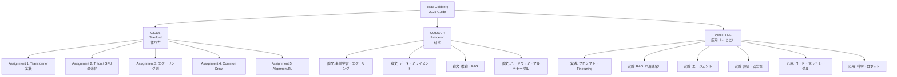

# CMU LLMs: Methods and Applications

> **Chenyan Xiong & Daphne Ipolito**（CMU LTI）による**LLM応用実践コース**。2026年春開講。プロンプトからエージェント、マルチモーダル、デプロイメントまで、LLMを使いこなすための全範囲をカバー。Yoav Goldbergのガイド中で**最も入門しやすい**バランスの取れたコース。

---

## なぜこのコースが特別か

1. **最新版（2026年春）** — このガイドの3コース中で最も新しい。GRPO、Deep Research、Multi-agent等の最新トピックを含む
2. **「使う側」に特化** — 「作る」より「応用する」。エンジニア・プロダクトマネージャーに最適
3. **実践的課題** — 3つの課題（プロンプト→エージェント→マルチモーダル）が実務直結
4. **CMU LTIの幅広さ** — コード生成（Zora Wang）、音楽生成（Chris Donahue）、生物学（Lei Li）、ロボティクス（Leena Mathur）まで、応用先の多様性

---

## カリキュラム詳細とWikiマッピング

### フェーズ1: 基礎とコア技術（1月）

| 週 | トピック | 関連Wiki概念 |
|----|---------|-------------|
| 1-2 | LLMの起源と理論（Bengio 2003 → 現代） | `concepts/decoder-only-gpt`, `concepts/transformer-architecture` |
| 2-3 | プロンプトエンジニアリング | `concepts/context-engineering`, `concepts/direct-prompting-philosophy` |
| 3-4 | ファインチューニング vs 他の手法 | `concepts/fine-tuning/peft-lora-qlora`, `concepts/fine-tuning/_index` |
| 4 | 埋め込みと知識表現 | — |

> **独自の価値:** プロンプトエンジニアリングを「科学」として捉える。ランダムな種系列への敏感さ（*Quantifying Language Models' Sensitivity to Spurious Features in Prompt Design*）を扱うのは、他のコースにはない実践的視点。

### フェーズ2: 検索と高度なインタラクション（2月）

| 週 | トピック | 関連Wiki概念 |
|----|---------|-------------|
| 5-7 | **RAG（3回連続）**: 知識格納、実装、Deep Research | `concepts/agentic-rag`, `concepts/context-rot`, `concepts/graph-db-overengineering-rag` |
| 7-8 | 対話システム: タスク指向、ツール使用、ペルソナ | `concepts/agent-orchestration-frameworks`, `concepts/agent-harness` |
| 8 | **クリエイティブAI**: ライティング支援、アイデア創出 | — |
| 9 | **評価**: LLM-as-Judge、合成データ、シミュレーション | `concepts/llm-as-judge`, `concepts/critique-shadowing` |
| 9 | **マルチエージェント**アーキテクチャ | `concepts/agent-architecture-decomposition`, `concepts/agent-swarms` |

> **独自の価値:** **RAGを3週連続で**扱うのは、このコースの最大の特徴。Deep Research（複数ステップの情報収集＋合成）までカバーするRAGの深堀りは、他のLLMコースにはない。**評価フェーズ**でLLM-as-Judgeと合成データ生成を組み合わせるのも実践的。

### フェーズ3: 安全性、倫理、専門領域（3月）

| 週 | トピック | 関連Wiki概念 |
|----|---------|-------------|
| 10 | LLMの安全性とRed Teaming | `concepts/ai-safety`, `concepts/excessive-agency`, `concepts/red-teaming-adversarial-eval` |
| 11 | **コード生成**（Zora Wang ゲスト） | `concepts/coding-agents`, `concepts/ai-coding-reliability` |
| 11 | **マルチモーダル**: 画像生成、VLM | `concepts/ai-image-generation`, `concepts/multimodal/_index` |
| 12 | **多言語LLM**: 非英語圏（Shaily Bhatt ゲスト） | — |
| 12 | **World Models**（Mingkai Deng ゲスト） | — |

> **独自の価値:** **多言語LLM**のトピックを含むのは、このコースの大きな強み。非英語圏・非米国文化の文脈でLLMがどう機能するかを議論する。Shaily Bhatt（MSR India）のような専門家をゲストに迎えている。

### フェーズ4: テキストを超えて＋デプロイ（4月）

| 週 | トピック | 関連Wiki概念 |
|----|---------|-------------|
| 13 | **科学応用**: 生物学（Lei Li）、音楽生成（Chris Donahue）、数学推論 | — |
| 14 | **Physical AI**: ロボット、身体化AI（Leena Mathur） | — |
| 14-15 | **デプロイ戦略** | `concepts/ai-infrastructure-engineering/model-serving-autoscaling`, `concepts/token-economics` |

> **独自の価値:** **AI x 科学**という応用指向の最終フェーズは、他のLLMコースにはないユニークな特徴。生物学（タンパク質、創薬）、音楽生成、数学、ロボティクスと、LLMが「言語モデル」から「基盤モデル」へ拡張される姿を俯瞰できる。

---

## このコースのポートフォリオ全体での位置づけ

---

## このコースの限界

- **理論の深さが限定的** — 最先端の理論を深掘りしたい研究者には物足りない。それはCOS597Rの役割
- **実装が少ない** — 3課題だが、CS336ほどのコード量はない。LLMを「作る」側の知識はカバーしない
- **応用範囲の広さが浅さにつながる** — 多様なトピックをカバーする一方、各トピックの深さは限定的
- **受動的学習になりがち** — 講義主体の形式で、Debate Panelのような批判的議論の訓練はない

---

## 学習優先順位の中での位置づけ

| 側面 | CMU LLMs | 代替コース |
|------|---------|-----------|
| 入門しやすさ | 🟢 **最高。前提知識最小限** | CS336: Python習熟必須 |
| 応用範囲 | 🟢 LLM全応用力タログ | COS597R: 研究に特化 |
| 理論の深さ | 🟡 応用に必要な分だけ | COS597R: 論文ベースで深い |
| 実装量 | 🟡 3課題（適度） | CS336: 5課題（大量） |
| 最新トピック | 🟢 2026年春版で最新 | COS597R: 2024年で固定 |

---

## 関連Wikiページ

- [[concepts/learning-llms-in-2025]] — Yoav Goldbergの全体ガイド
- [[concepts/stanford-cs336-language-modeling-from-scratch]] — もう一つのおすすめ（実装寄り）
- [[concepts/princeton-cos597r-deep-dive-llm]] — もう一つのおすすめ（研究寄り）
- [[concepts/agentic-rag]] — RAG（第5-7週）
- [[concepts/llm-as-judge]] — LLM評価（第9週）
- [[concepts/agent-orchestration-frameworks]] — マルチエージェント（第9週）
- [[concepts/ai-image-generation]] — マルチモーダル（第11週）
- [[concepts/ai-safety]] — 安全性（第10週）
- [[concepts/fine-tuning/peft-lora-qlora]] — ファインチューニング（第3-4週）
- [[concepts/context-engineering]] — プロンプトエンジニアリング（第2-3週）
- [[concepts/coding-agents]] — コード生成（第11週）

---

> **このページはメタ知識（知識マップ）です。** CMU LLMs: Methods and Applications のカリキュラム構造をWiki概念にマッピングしています。実際の講義資料や課題はcmu-llms.org/schedule/ を参照してください。
