# CMU LLMs: Methods and Applications

> A **practical LLM application course** taught by **Chenyan Xiong & Daphne Ipolito** (CMU LTI). Offered Spring 2026. Covers the full range of LLM proficiency — from prompting to agents, multimodal, and deployment. The **most beginner-friendly** and well-balanced course in Yoav Goldberg's guide.

---

## Why This Course Is Special

1. **Latest edition (Spring 2026)** — The newest of the 3 courses in this guide. Covers GRPO, Deep Research, Multi-agent, and other cutting-edge topics
2. **"User-side" focus** — Emphasizes "applying" over "building." Ideal for engineers and product managers
3. **Practical assignments** — 3 assignments (prompting → agents → multimodal) that directly connect to real-world work
4. **CMU LTI breadth** — Code generation (Zora Wang), music generation (Chris Donahue), biology (Lei Li), robotics (Leena Mathur) — diverse application areas

---

## Curriculum Details and Wiki Mapping

### Phase 1: Foundations & Core Techniques (January)

| Week | Topic | Related Wiki Concepts |
|----|---------|-------------|
| 1-2 | LLM origins and theory (Bengio 2003 → present) | `concepts/decoder-only-gpt`, `concepts/transformer-architecture` |
| 2-3 | Prompt engineering | `concepts/context-engineering`, `concepts/direct-prompting-philosophy` |
| 3-4 | Fine-tuning vs other methods | `concepts/post-training/peft-lora-qlora`, `concepts/post-training/_index` |
| 4 | Embeddings and knowledge representation | — |

> **Unique value:** Treats prompt engineering as a "science." Addressing sensitivity to random seed series (*Quantifying Language Models' Sensitivity to Spurious Features in Prompt Design*) is a practical perspective not found in other courses.

### Phase 2: Retrieval & Advanced Interaction (February)

| Week | Topic | Related Wiki Concepts |
|----|---------|-------------|
| 5-7 | **RAG (3 consecutive weeks)**: Knowledge storage, implementation, Deep Research | `concepts/agentic-rag`, `concepts/context-rot`, `concepts/graph-db-overengineering-rag` |
| 7-8 | Dialogue systems: Task-oriented, tool use, personas | `concepts/agent-orchestration-frameworks`, `concepts/agent-harness` |
| 8 | **Creative AI**: Writing assistance, idea generation | — |
| 9 | **Evaluation**: LLM-as-Judge, synthetic data, simulation | `concepts/llm-as-judge`, `concepts/critique-shadowing` |
| 9 | **Multi-agent** architectures | `concepts/agent-architecture-decomposition`, `concepts/agent-swarms` |

> **Unique value:** **Dedicating 3 consecutive weeks to RAG** is this course's biggest strength. Covering Deep Research (multi-step information gathering + synthesis) goes deeper into RAG than any other LLM course. Combining **LLM-as-Judge with synthetic data generation** in the evaluation phase is also highly practical.

### Phase 3: Safety, Ethics & Specialized Domains (March)

| Week | Topic | Related Wiki Concepts |
|----|---------|-------------|
| 10 | LLM safety and Red Teaming | `concepts/ai-safety`, `concepts/excessive-agency`, `concepts/red-teaming-adversarial-eval` |
| 11 | **Code generation** (Zora Wang guest) | `concepts/coding-agents`, `concepts/ai-coding-reliability` |
| 11 | **Multimodal**: Image generation, VLM | `concepts/ai-image-generation`, `concepts/multimodal/_index` |
| 12 | **Multilingual LLM**: Non-English contexts (Shaily Bhatt guest) | — |
| 12 | **World Models** (Mingkai Deng guest) | — |

> **Unique value:** Including **multilingual LLM** topics is a major strength. Discusses how LLMs function in non-English, non-US cultural contexts with experts like Shaily Bhatt (MSR India) as guests.

### Phase 4: Beyond Text + Deployment (April)

| Week | Topic | Related Wiki Concepts |
|----|---------|-------------|
| 13 | **Scientific applications**: Biology (Lei Li), music generation (Chris Donahue), math reasoning | — |
| 14 | **Physical AI**: Robotics, embodied AI (Leena Mathur) | — |
| 14-15 | **Deployment strategies** | `concepts/ai-infrastructure-engineering/model-serving-autoscaling`, `concepts/token-economics` |

> **Unique value:** The **AI x Science** application-focused final phase is a unique feature not found in other LLM courses. From biology (proteins, drug discovery) to music generation, mathematics, and robotics — it provides a panoramic view of LLMs expanding from "language models" to "foundation models."

---

## Position in the Overall Course Portfolio

```mermaid
flowchart TD
    A["Yoav Goldberg<br/>2025 Guide"] --> B["CS336<br/>Stanford<br/>Building"]
    A --> C["COS597R<br/>Princeton<br/>Research"]
    A --> D["CMU LLMs<br/>Application (← Here)"]
    
    B --> B1["Assignment 1: Transformer implementation"]
    B --> B2["Assignment 2: Triton / GPU optimization"]
    B --> B3["Assignment 3: Scaling laws"]
    B --> B4["Assignment 4: Common Crawl"]
    B --> B5["Assignment 5: Alignment/RL"]
    
    C --> C1["Papers: Pretraining, Scaling"]
    C --> C2["Papers: Data, Alignment"]
    C --> C3["Papers: Reasoning, RAG"]
    C --> C4["Papers: Hardware, Multimodal"]
    
    D --> D1["Practice: Prompting, Finetuning"]
    D --> D2["Practice: RAG (3 weeks straight)"]
    D --> D3["Practice: Agents"]
    D --> D4["Practice: Evaluation, Safety"]
    D --> D5["Applications: Code, Multimodal"]
    D --> D6["Applications: Science, Robotics"]
```

---

## Limitations of This Course

- **Limited theoretical depth** — Researchers seeking cutting-edge theoretical depth will find this insufficient; that's the role of COS597R
- **Less implementation** — 3 assignments, but not as much code as CS336. Does not cover "building" LLMs
- **Breadth can lead to shallowness** — While covering diverse topics, depth in each topic is limited
- **Tends toward passive learning** — Lecture-driven format without the critical debate training found in Debate Panels

---

## Position Among Learning Priorities

| Aspect | CMU LLMs | Alternative Courses |
|------|---------|-----------|
| Accessibility | 🟢 **Best. Minimal prerequisites** | CS336: Python proficiency required |
| Application scope | 🟢 Full LLM application catalog | COS597R: Research-focused |
| Theoretical depth | 🟡 Just enough for application | COS597R: Paper-based, deeper |
| Implementation volume | 🟡 3 assignments (moderate) | CS336: 5 assignments (intensive) |
| Cutting-edge topics | 🟢 Spring 2026 edition, most current | COS597R: Fixed at 2024 |

---

## Related Wiki Pages

- [[concepts/learning-llms-in-2025]] — Yoav Goldberg's overall guide
- [[concepts/stanford-cs336-language-modeling-from-scratch]] — Another recommendation (implementation-focused)
- [[concepts/princeton-cos597r-deep-dive-llm]] — Another recommendation (research-focused)
- [[concepts/agentic-rag]] — RAG (weeks 5-7)
- [[concepts/evaluation/llm-as-judge]] — LLM evaluation (week 9)
- [[concepts/multi-agents/agent-orchestration-frameworks]] — Multi-agent (week 9)
- [[concepts/ai-image-generation]] — Multimodal (week 11)
- [[concepts/security-and-governance/ai-safety]] — Safety (week 10)
- [[concepts/post-training/peft-lora-qlora]] — Fine-tuning (weeks 3-4)
- [[concepts/context-engineering|Context Engineering]] — Prompt engineering (weeks 2-3)
- [[concepts/coding-agents/coding-agents]] — Code generation (week 11)

---

> **This page is meta-knowledge (knowledge map).** It maps the curriculum structure of CMU LLMs: Methods and Applications to wiki concepts. For actual lecture materials and assignments, refer to cmu-llms.org/schedule/.
