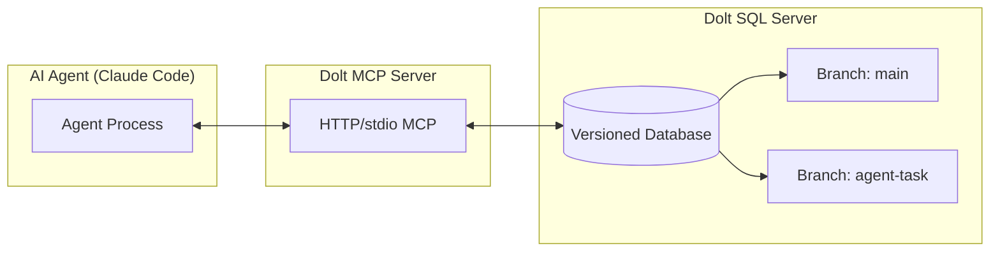

# Dolt

## Overview

**Dolt** is the world's first and only version-controlled SQL database ("Git for Data"). Developed by **DoltHub Inc.**, Dolt brings full Git-style version control (commit, branch, merge, diff, push, pull, clone) to relational databases. It is MySQL-compatible (with Postgres via Doltgres and SQLite via DoltLite in beta), making it a drop-in replacement for existing MySQL databases while adding version control capabilities.

Dolt emerged from the realization that AI agents need **database branches** to perform writes safely — without version control, agent interactions with databases risk data corruption and are difficult to audit or roll back. In 2025, DoltHub pivoted its messaging around "Dolt is the database for AI," positioning version-controlled databases as a core requirement for agentic workflows.

Initial release: **August 2019**. Open source under Apache 2.0 license.

## History & Key Milestones

| Date | Milestone |
|------|-----------|
| Aug 2019 | Initial release of Dolt (MySQL-compatible version-controlled database) |
| May 2022 | **Hosted Dolt** launched — fully managed cloud Dolt (AWS for Dolt) |
| 2022 | **DoltLab** launched — self-hosted DoltHub (GitLab for Dolt) |
| Mar 2024 | Prolly Trees technical deep-dive published |
| Apr 2025 | **Doltgres** enters beta — Postgres-compatible version-controlled database |
| Jul 2025 | **Multihost DoltLab** — Docker Swarm-based enterprise deployment |
| Aug 2025 | **Dolt MCP Server** announced — Model Context Protocol interface for versioned databases |
| Sep 2025 | Vector column support, skinning diffs, unit testing for databases, conflict resolution on DoltHub |
| Oct 2025 | **Non-local tables** — reference tables across Dolt databases |
| Nov 2025 | "Cursor for Everything" — Dolt as database layer for agentic workflows |
| Dec 2025 | "AI Database" — Dolt positioned as the persistence layer for AI agents |
| Jan 2026 | How to version control a database — Prolly Trees proven as the only viable approach |
| 2026 Q1 | Doltgres GA milestones (stored procedures, window functions, CTEs, full psql support) |

## Core Architecture

Dolt's storage engine combines two key data structures:

### Prolly Trees (Probabilistic B-Trees)

- A content-addressed B-tree, originally invented by the **Noms** team (Attic Labs)
- Each Prolly Tree node has a content address (hash) — nodes sharing the same content are stored only once (structural sharing)
- Block size averages 4KB; a single cell change creates ~4KB × tree-depth of new data
- **Key-only rolling hash**: Unlike Noms' original implementation, Dolt's Prolly Trees compute chunk boundaries on keys only (not values), improving update performance since SQL values have fixed maximum sizes
- Enables fast **diff** between any two commits and efficient **merge** with conflict resolution

### Commit Graph (Merkle DAG)

- All database objects (table data, schema, secondary indexes, system tables) are stored as Prolly Trees
- The roots of these trees are hashed together into a **database content address**
- These addresses form a **commit graph** (Merkle DAG) similar to Git's, providing full version history from inception
- Supports `dolt_history_<tablename>` for cell-level lineage tracking

```
Prolly Trees + Commit Graph = Dolt Storage Engine
```

## Key Features

### Git-Style Version Control
- **Commit** — snapshot the entire database state at any point
- **Branch** — create isolated workspaces for experiments, agent tasks, or schema changes
- **Merge** — merge branches with cell-level conflict resolution
- **Diff** — queryable diffs between any two commits, branches, or tags
- **Clone/Push/Pull** — distributed replication using Dolt remotes
- **Revert** — `dolt_revert()` to undo specific commits; `dolt_undrop()` to recover from `DROP DATABASE`
- **As-of queries** — `SELECT ... AS OF '<commit-hash>'` to query past states

### MySQL Compatible
- Drop-in replacement for MySQL (same protocol, same SQL dialect)
- Supports foreign keys, secondary indexes, triggers, check constraints, stored procedures
- Up to 12-table JOINs
- Can be used with any MySQL client or ORM

### SQL Interface for Version Control
- **System tables** — `dolt_log`, `dolt_branches`, `dolt_diff_<table>`, `dolt_history_<table>`
- **Stored procedures** — `DOLT_COMMIT()`, `DOLT_CHECKOUT()`, `DOLT_MERGE()`, `DOLT_BRANCH()`
- Full Git-like CLI (`dolt checkout`, `dolt merge`, `dolt push`, etc.)

### Agent-First Design
- **Dolt MCP Server** — standardized Model Context Protocol interface for agents to interact with versioned databases
- Agents write to **isolated branches** — mistakes are contained, branches can be discarded
- Human-in-the-loop via **Pull Requests** (schema + data changes reviewed before merging)
- **Three Pillars of Agentic AI**: capable model + version control + testing (Dolt provides the latter two for data)

## Product Ecosystem

| Product | Description |
|---------|-------------|
| **Dolt** | MySQL-compatible, open-source, version-controlled database |
| **Doltgres** | Postgres-compatible, open-source, version-controlled database (beta → GA 2026) |
| **DoltLite** | SQLite-compatible, open-source, version-controlled database |
| **Hosted Dolt** | Fully managed cloud Dolt (AWS for Dolt) |
| **DoltHub** | GitHub-style collaboration platform for Dolt databases (dolthub.com) |
| **DoltLab** | GitLab-style self-hosted collaboration platform |
| **Dolt MCP** | Model Context Protocol server for AI agents |
| **Dolt Workbench** | GUI for SQL interactions |

## Dolt + AI Agents

Dolt's unique value proposition for AI agents:

1. **Safe agent-database interaction** — agents write on branches; errors never touch production
2. **Auditable agent actions** — every agent change is a Dolt commit with full lineage
3. **Multi-agent coordination** — each agent gets its own branch; merge coordinates changes
4. **Schema evolution by agents** — agents can `ALTER TABLE` on a branch; reviewed before merge
5. **Data testing** — Dolt enables database-level testing (unit tests on data changes)
6. **Training data versioning** — used by companies like Flock Safety for model reproducibility

### Dolt MCP in Practice



The agent connects to a branch → makes changes → commits → creates a Pull Request → human reviews → merge to main.

### Case Study: Agentic Data Collection (Cocktail Database)

In August 2025, DoltHub demonstrated Claude Code autonomously:
1. Creating a branch `vegan-cocktails`
2. Running `ALTER TABLE cocktails ADD COLUMN dietary_restrictions JSON` (schema evolution)
3. Researching 10 vegan cocktail recipes via web search
4. Inserting full data (ingredients, measurements, directions, source URLs)
5. Making two distinct commits (schema + data)
6. Opening a Pull Request for human review

All changes were isolated to a branch — zero risk to production data.

## Related Concepts & Tools

- [[beads]] — Distributed graph issue tracker for AI agents, **powered by Dolt**
- [[programmatic-tool-calling]] — Code execution as tool calling; Dolt MCP provides agents a database tool surface
- [[dspyrlm]] — RLM (Reasoning via Language Model) pattern; Dolt enables persistent state for RLM workflows
- [[concepts/version-controlled-databases]] — Broader concept of databases with Git-like versioning

## Ecosystem Comparisons

| Aspect | Dolt | Traditional DB (MySQL/Postgres) | Neon (branching Postgres) |
|--------|------|--------------------------------|---------------------------|
| **Version control** | Full Git: branch, merge, diff, push, pull, clone | MVCC only (transactions) | Branches = forks (no merge, no diff) |
| **Cell-level lineage** | `dolt_history_<table>` shows every cell change | No | No |
| **Merge with conflict resolution** | Yes (cell/row level) | No | No |
| **Agent-safe writes** | Agent writes on branch → PR → merge | Direct writes, no isolation | Separate DB fork |
| **SQL compatibility** | MySQL (native), Postgres (Doltgres), SQLite (DoltLite) | Native | Postgres |

## Challenges

- **Performance**: Prolly Tree overhead vs B-tree for write-heavy OLTP workloads
- **SQL coverage**: Not all MySQL/Postgres features are implemented yet (e.g., stored procedures in Doltgres, window functions, CTEs — on roadmap for 2026)
- **Scale**: The Prolly Tree storage model means each change generates new tree nodes, increasing storage footprint vs. in-place updates
- **Maturity**: Doltgres still in beta; production-grade Postgres compatibility targeted for 2026

## Sources
- https://www.dolthub.com
- https://docs.dolthub.com/architecture/storage-engine
- https://docs.dolthub.com/architecture/storage-engine/prolly-tree
- https://www.dolthub.com/blog/2024-03-03-prolly-trees
- https://www.dolthub.com/blog/2025-08-14-announcing-dolt-mcp
- https://www.dolthub.com/blog/2025-09-08-agentic-ai-three-pillars
- https://www.dolthub.com/blog/2025-12-09-ai-database
- https://www.dolthub.com/blog/2026-01-07-how-to-version-control-a-database
- https://github.com/dolthub/dolt
- https://github.com/dolthub/dolt-mcp
